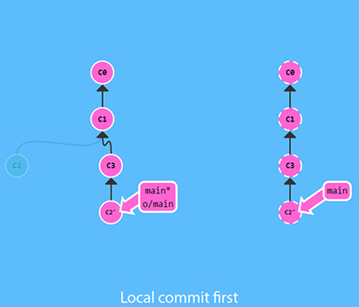
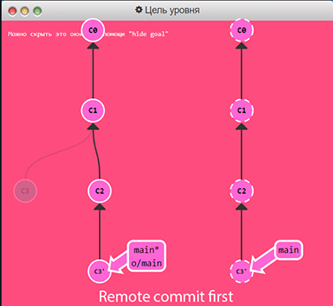
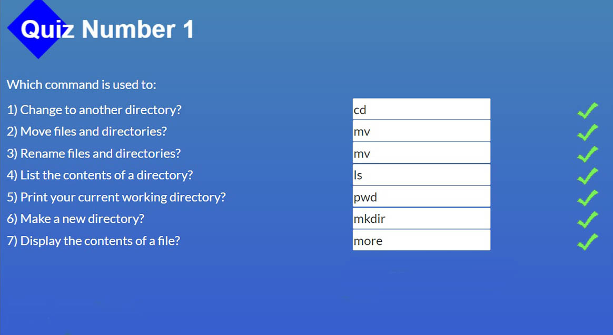
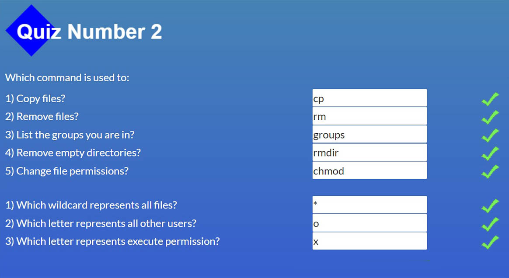
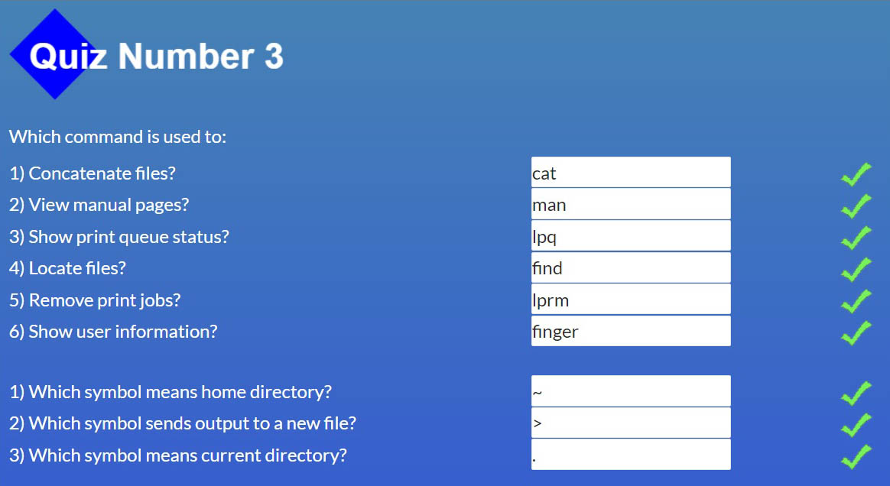
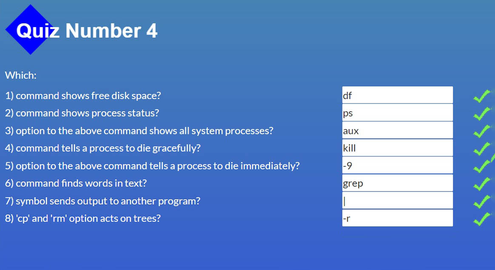

# **kottans-frontend course**

About me

I'm 36 y.o. Cat that working on some positive changes in my life. I have 2 y.o. daughter that "helps" me all the time, but I'll do my best to succeed (:

## **General: 0. Git Basics**

* **Introduction to Git and GitHub (1 & 2 Week)**

I had fragmentary knowledge about Git and very basic understanding how it works(I’m talking about fetch, merge, clone, pull, push, checkout, commit, add, status(all almost without fags) in most perfect situation when nothing goes wrong xD) so it wasn’t hard to understand the thing. But I got plenty new useful info about undoing actions in different work stages.

And funny thing that amazed me is that you can(and obviously should) use “commit” command just like that, not “commit -m “some ugly message that jumps to another line, cause its to long” 

* **Study specific parts learngitbranching.js.org:**

Oh! That was a fight! I don't know for sure, but I guess in <b>logic</b> this two solutions are equal, but only second counts as correct. Anyway, I got that!

Look for details(clickable)

 

## **Linux CLI, and HTTP**

Linux Survival (modules results)

 

What I found new? 60% оf CLI commands was new to me so it's a quite peace of information I got there! =)

Interesting? Don't know why, but when I heard **TCP/IP** I always thought the last "IP" was for IP-address. Sure! It's obvious! Why you would think different?))) But it happens **IP** is for **Internet Protocol**

What I will use in future? I hope everithing! :) No jokes, it's very important to know, even superficially, to know how the network works. CLI commands already in use with Git Bash. 