# **kottans-frontend course**

About me

I'm 36 y.o. Cat that working on some positive changes in my life. I have 2 y.o. daughter that "helps" me all the time, but I'll do my best to succeed (:

## **Git Basics**

* **Introduction to Git and GitHub (1 & 2 Week)**

  I had fragmentary knowledge about Git and very basic understanding how it works(I’m talking about fetch, merge, clone, pull, push, checkout, commit, add, status(all almost without fags) in most perfect situation when nothing goes wrong xD) so it wasn’t hard to understand the thing. But I got plenty new useful info about undoing actions in different work stages.

  And funny thing that amazed me is that you can(and obviously should) use “commit” command just like that, not “commit -m “some ugly message that jumps to another line, cause its to long”” 

* **Study specific parts learngitbranching.js.org:**

  Oh! That was a fight! I don't know for sure, but I guess in **logic** this two solutions are equal, but only second counts as correct. Anyway, I got that!

Look for details

 

## **Linux CLI, and HTTP**

* ***What I found new***? 60% оf CLI commands was new to me so it's a quite peace of information I got there! =)

* ***Interesting?*** Don't know why, but when I heard **TCP/IP** I always thought the last "IP" was for IP-address. Sure! It's obvious! Why you would think different?))) But it happens **IP** stands for **Internet Protocol**

* ***What I will use in future?*** I hope everything! :) No jokes, it's very important to know, even superficially, to know how the network works. CLI commands already in use with Git Bash.

Linux Survival (modules results)

 

## **Git Collaboration**

* ***What I found new?*** Almost everything beyond basic add, commit, push, pull and fetch was new. 

* ***What's interesting?*** Was very interesting to work in sandbox, 'cause there is a possibility to test command(even not related to current task) and see visually how it would unfold.

* ***What I will use in future?*** I have vague understanding where to use all that tricky-additional-arguments-commands on practice, but now as I know about their existence I guess it will be like in movie: “You will know when the time comes..."

Introduction to Git and GitHub (modules results)

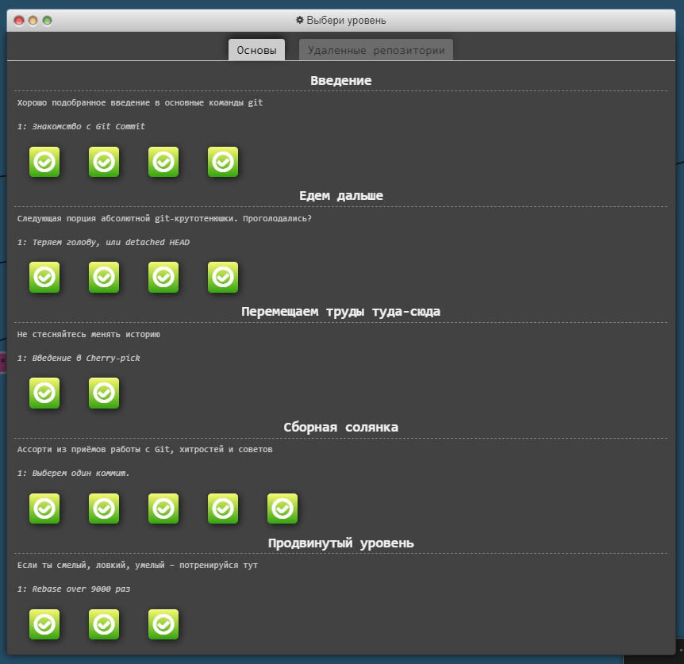
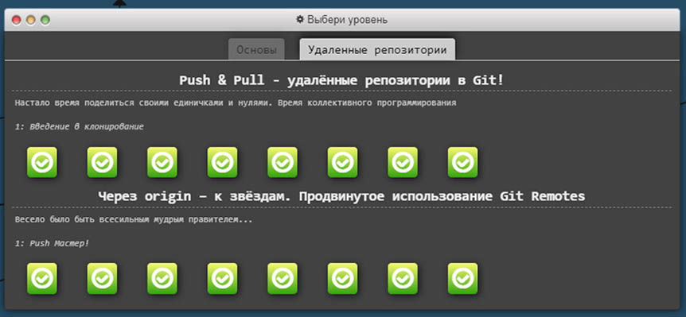

Learn Git Branching (modules results)

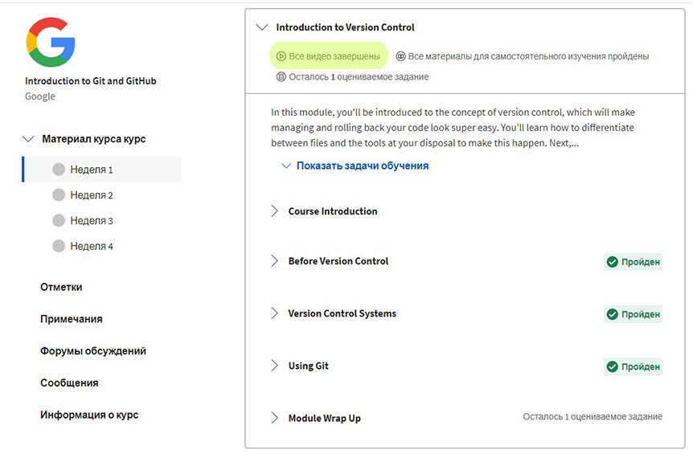
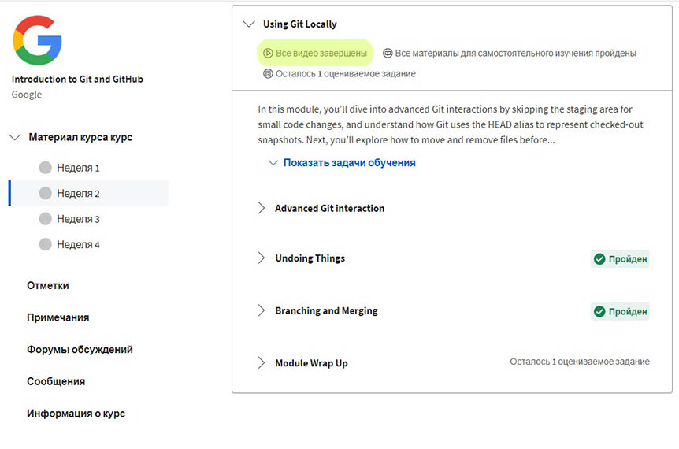
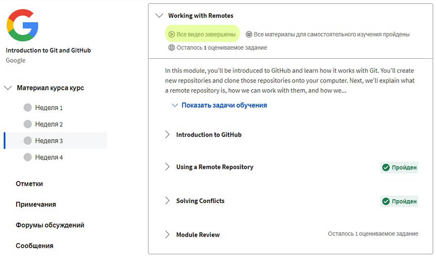
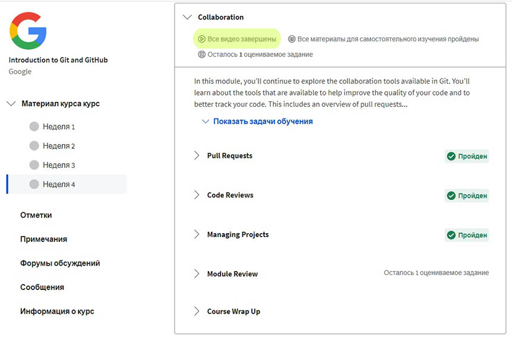

## **Intro to HTML and CSS**

* ***What I found new?*** Never heard before about possibility to set opacity value inside hexadecimal color description **#52BC8280** 

  Met for the first time @font-face option, it's very cool thing!

  Heard very little about float and grid before, was interesting to see how it works on examples.

* ***What's interesting?*** I found very intelligible the way Positioning was covered in Coursera videos. I was familiar with the topic, but Coursera and CodeAcademy course altogether made the picture very clear. 

  It's fantastic like they give you the information for each positioning type like "this type of positioning will remove element from the document flow", "Z-index won't work" or "to make it work width value must be set", and then you are like: *"Oh! So that's where the problem was!.."*

  Same thing about margin collapse - very clear with all that schemes. I would say: *"И горизонтальный, и вертикальный margin складывается, но есть нюанс..."* :satisfied:

* ***What I will use in future?***
It's so basics I guess "all" will be the answer.

HTML & CSS - CodeAcademy and Coursera (modules results)

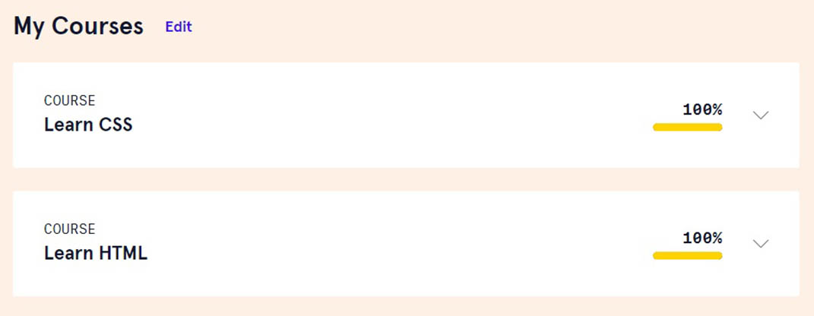
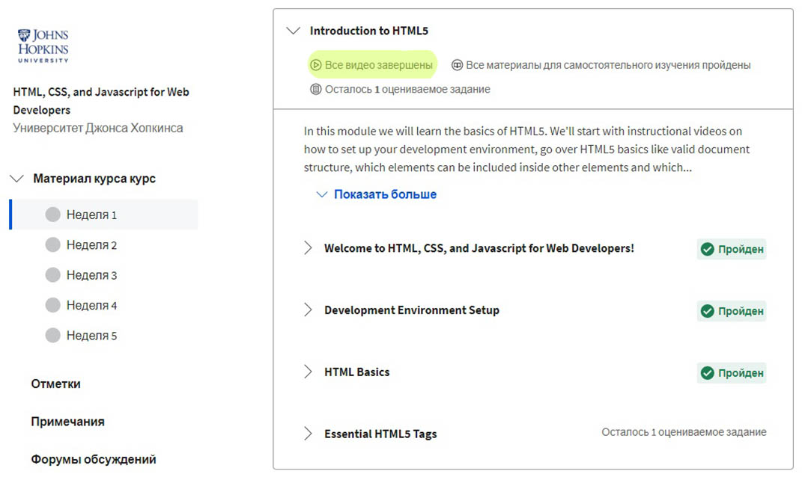
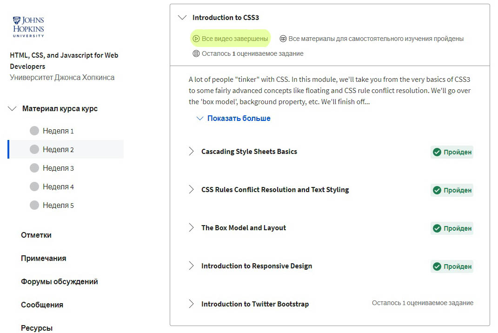

## **Responsive Web Design**
* ***What I found new?*** 
That was enlightenment how you can use flex to build up basic page structure just with few code lines! And here you go: footer always pinned down!

* ***What's interesting?***
All that info about Grid Layout was very interesting. I guess I need some more time and practice to have it all set in my mind.

  The games were most fun way of learn & practice!

* ***What I will use in future?***

  Looking forward for use grid layout somewhere! xD

Flex & Grid games (results)

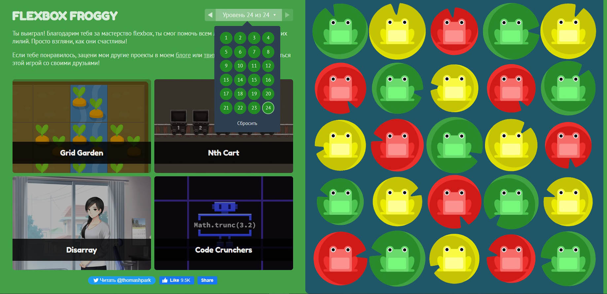
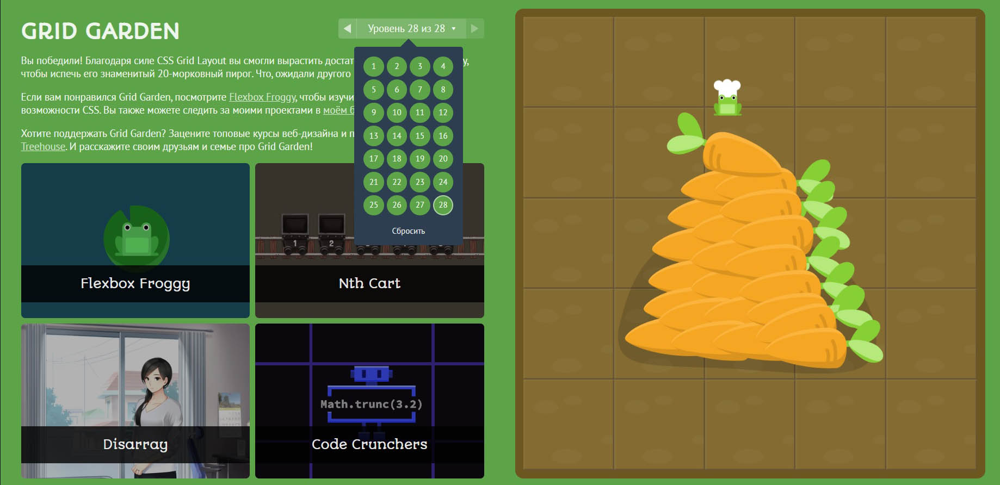

